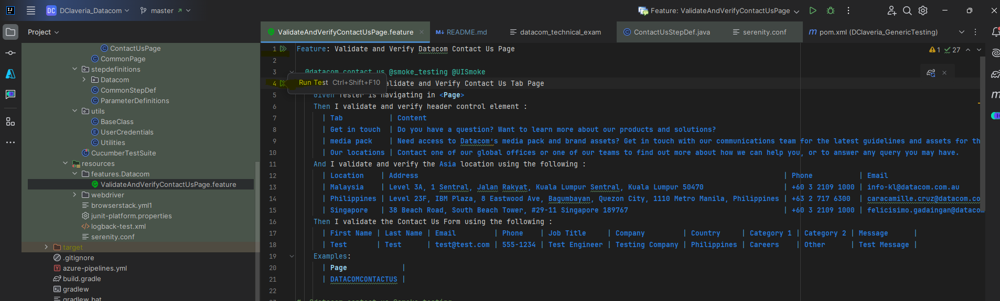
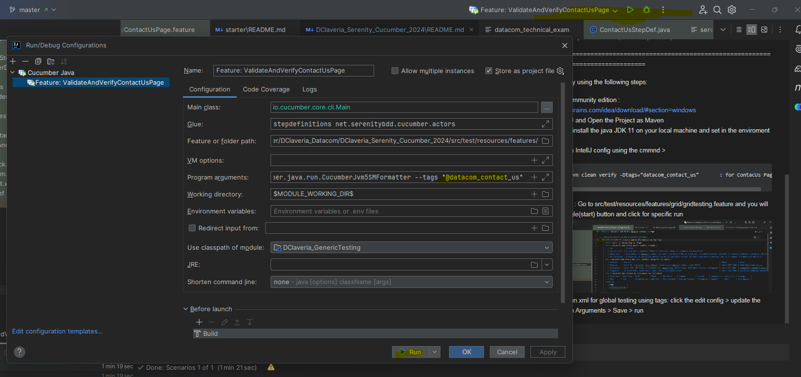

Code Exam
The point of the exercise is to see how an applicant can code and how they solve problems.
The applicant will need to be able to discuss different aspects of the code, solution, and next steps.
The code will not be used in any capacity after the interview and will not be used by the business.
Using AI (such as an LLM) is explicitly disallowed for the code exam.
Use of AI will disqualify the applicant.
Using AI will disqualify the applicant.

The applicant is requested to write test automation to do the following:
Write automated tests that will find any bugs, validate the page loading, and validate that the controls work (i.e. the navigation works).
The suggested framework Selenium with jUnit or testNG.
BDD is not required but preferred.

Details
The ‘Our Locations’ page found in https://datacom.com/nz/en/contact-us .
Write test cases and automate the test cases where the following criteria is met:
the test case will give value if automated
the test can be developed in the allocated time.
You should not spend more than 4hr working on this evaluation.
Be prepared to show your work and discuss it.
The applicant may or may not run the tests in a Jenkins pipeline.
The applicant may or may not use Docker containers.
The applicant is encouraged to expand on the original scope if they so desire.

========================================================================================================

Dheo Claveria - Technical Exam - Test Automation Testing

Programming Language       : Java
Automation Tools           : Selenium WebDriver, Serenity BDD, Cucumber, Screenplay
IDE                        : IntelliJ (community edition)

========================================================================================================

You can test it locally using the following steps:

1. Install IntellJ community edition              : https://www.jetbrains.com/idea/download/#section=windows
3. Open the IntellJ and Open the Project as Maven
4. Make sure you install the java JDK 11 on your local machine and set in the enviroment variables :
5. You can test via IntellJ config using the cmmnd >

               * "mvn clean verify -Dtags="datacom_contact_us"       : for ContacUs Page
       
6. Or Using IntellJ :
   Go to src/test/resources/features/grid/gridtesting.feature and you will the green triangle(start) button and click for specific run
 
    
7. Or using the Run.xml for global testing using tags: click the edit config > update the tags in Program Arguments > Save > run

   